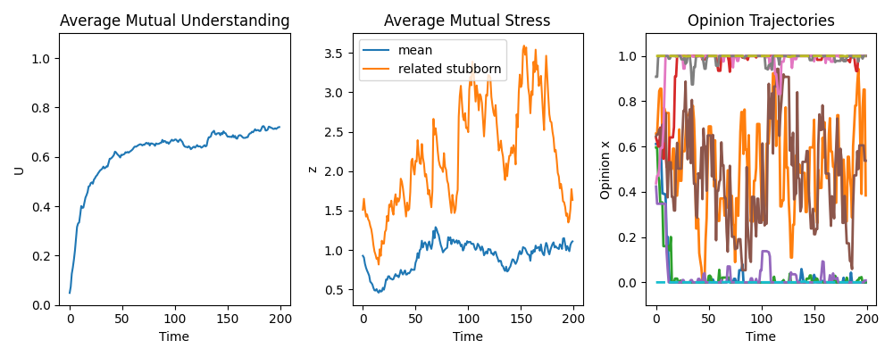

# tiny_simulations

Small simulation scripts used for blog posts and experiments.

## Purpose

To recognize a piece of the world more clearly,  
I use simple simulations.

The focus is on:
- simple models
- explicit assumptions
- quick experimentation
- one post, one code

## Contents
```text
tiny_simulations/
├─ discussion/ 
├─ ec_sim/
├─ life_rhythm/
├─ monetary_policy/
├─ statistics/
├─ train/ 
├─ X_vs_threads/
└─ README.md
```
## Example figure


## Japanese blog
https://qiita.com/YASUHARA-Wataru/items/dffe14632b3f3af6d34b

## License
MIT License

